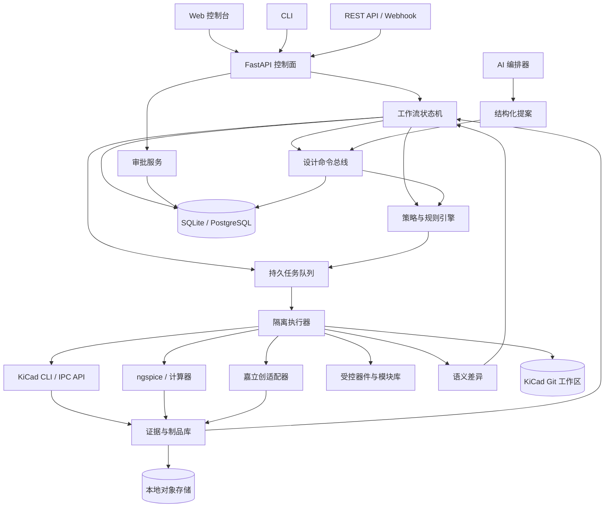

# 自动化 PCB 开发平台设计与开发指导

> 状态：已批准，进入分阶段实施
> 日期：2026-07-29
> 首版范围：2-4 层 MCU/嵌入式控制板
> 核心 EDA：KiCad 9 系列
> 制造目标：嘉立创 PCB 专业板与 SMT，下游兼容通用制造厂
> 运行形态：本地优先，Web 控制台 + CLI + REST API

## 1. 文档目的

本文定义一个从需求输入到投板发布、再到生产测试反馈的自动化 PCB 开发平台。它既是产品设计规范，也是后续拆分代码、接口、数据库、测试、提示词和里程碑的开发基线。

平台的核心结论如下：

1. KiCad 工程是唯一设计真源。嘉立创 EDA 专业版是交换与人工协作端，不与 KiCad 形成双主写入。
2. 确定性工作流内核是唯一有权推进阶段、修改工程和发布制品的组件。
3. AI 只能生成结构化提案、命令或审查结论，不能直接修改 KiCad 文件、数据库状态或发布目录。
4. 常规任务默认自动推进；需求冻结、原理图批准、PCB 批准、投板发布四个高风险节点必须人工批准。
5. 每个结论都必须可追溯到需求、工具输出、数据手册、规则包、审批或人工豁免。
6. 无法证明正确时必须阻断并说明缺少什么证据，不允许静默降级或用 AI 猜测替代工程验证。

## 2. 已确认决策

| 决策项 | 结论 | 原因 |
| --- | --- | --- |
| EDA 底座 | KiCad 9 系列 | 文件可版本化，CLI 与 IPC API 适合自动化，生态开放 |
| 自动化模式 | 人机协同全流程 | 保留关键工程责任边界，同时最大化低风险自动推进 |
| 部署方式 | 本地优先 | KiCad、模型、器件资料和工程数据默认不离开本机 |
| 首版板卡 | 2-4 层 MCU/嵌入式控制板 | 可覆盖大量控制类项目，又能控制自动布板风险 |
| 暂缓范围 | DDR、PCIe、射频天线、千兆以上高速链路 | 需要专用约束求解、仿真与专家审核能力包 |
| 制造适配 | 嘉立创专业板规则 + 嘉立创 SMT + 通用制造输出 | 满足国内打样，同时避免锁死单一供应商 |
| EDA 交换 | 支持嘉立创 EDA 专业版导入/导出，但以 KiCad 为主 | 避免双向无冲突合并这个高风险问题进入首版 |
| 系统骨架 | 确定性工作流 + 受控模块库 + AI 辅助 | 可审计、可恢复、可测试，也保留生成能力 |
| 技术基线 | Python/FastAPI，React/TypeScript，SQLite/PostgreSQL | 本地部署成本低，接口清晰，团队模式可扩展 |

## 3. 目标、非目标与成功标准

### 3.1 产品目标

- 将自然语言需求编译为版本化、机器可校验的工程约束。
- 自动完成成熟模块选型、器件映射、原理图组装、规则检查、PCB 初始实现、制造资料生成和报告汇总。
- 为工程师提供清晰的差异、证据、风险、修复建议和审批入口。
- 在进程退出、工具崩溃、机器重启或重复提交后可靠恢复，不重复产生副作用。
- 让同一输入、同一工具链锁和同一规则包尽可能产生可复现结果。
- 保留完整审计链：谁在何时基于什么输入执行了什么命令，产生了什么差异和证据，谁批准了发布。

### 3.2 首版非目标

- 不承诺从任意一句描述一次性生成可直接量产的 PCB。
- 不做自由形态的端到端神经网络自动布线器。
- 不支持两个 EDA 工程的自动双向合并；外部修改必须作为变更提案重新导入。
- 不绕过 KiCad ERC/DRC、制造规则或人工审批门。
- 不把器件库存、价格、生命周期或厂商能力视为永久事实。
- 不在首版处理高速串行、DDR、RF、天线调谐、刚挠结合、HDI、嵌埋器件等专业设计。
- 不自动登录并提交真实订单；首版只生成和验证下单包，最终下单由人确认。

### 3.3 可量化成功标准

首个稳定版本以一块参考控制板为纵向验收样例：`12-24V` 输入、反接/浪涌保护、降压与 `3.3V` 电源、MCU、SWD、RS-485、I2C 传感器接口、两路 MOSFET 输出、状态 LED 和安装孔。

验收标准：

- 从结构化需求创建项目到生成候选制造包，除四个审批门外无需手工搬运文件。
- 进程在任意任务中止后，重新启动能从最后一个已提交检查点继续。
- 重复执行同一命令不会重复添加器件、网络、文件或审批记录。
- 所有发布包均包含 ERC、DRC、BOM、坐标、规则预检和文件哈希证据。
- 阻断级 ERC/DRC 为零，未布线为零，未解释的规则豁免为零。
- BOM 中所有装配器件均有 MPN、封装、数量和供应来源；嘉立创装配模式下还必须有有效立创商城料号与贴装状态快照。
- 在锁定环境中对同一版本重新生成发布包，语义内容一致；时间戳等非确定字段被归一化后哈希一致。
- 关键领域逻辑单元测试覆盖率不低于 90%，整体后端不低于 80%。
- 至少包含 10 个故障注入场景：KiCad 崩溃、超时、坏工程、数据库锁、磁盘空间不足、规则包缺失、库存过期、AI 输出非法、审批并发和发布中断。

## 4. 设计原则与信任边界

### 4.1 唯一写入路径

任何入口都不能直接写 KiCad 工程：

```text
用户 / API / AI / 导入器
        -> Proposal
        -> Schema Validation
        -> Policy Evaluation
        -> DesignCommand
        -> Isolated Workspace
        -> Tool Validation
        -> Semantic Diff
        -> Commit or Reject
```

只有命令执行器可以把隔离工作区的已验证变更提交到主工作区。审批服务只能签署已冻结的候选版本，不能在审批时偷偷重算或改写内容。

### 4.2 证据优先

每个自动决策都必须区分：

- `fact`：来自项目文件、工具输出、规则包、数据手册或供应商快照。
- `derived`：通过版本化计算器从事实推导出的结果。
- `proposal`：AI 或规则引擎建议，尚未成为设计事实。
- `assumption`：明确标记、带影响和关闭条件的假设。
- `waiver`：由具名审批人接受的例外，带到期时间和适用范围。

AI 不得把 `proposal` 或 `assumption` 表述成 `fact`。

### 4.3 最小可逆变更

- 一个命令只表达一个可审查意图，例如“把 U3 的去耦电容从 1 个改为 2 个”。
- 命令必须声明基线版本、前置条件、预期影响和验证集合。
- 大任务拆成命令批次；每个批次通过验证后才形成检查点。
- 文件级回滚使用不可变快照，领域级回滚优先使用反向命令。

### 4.4 能力检测而非版本猜测

启动时探测 KiCad、插件、Python、ngspice 和嘉立创交换能力，生成 `capability-report.json`。项目清单锁定实际可用能力。适配器不得仅根据版本字符串假定某个命令或 IPC 操作可用。

## 5. 总体架构



### 5.1 运行进程

本地单机默认启动四个逻辑进程，可在开发模式合并：

| 进程 | 责任 | 禁止事项 |
| --- | --- | --- |
| `pcbflow-api` | HTTP、认证、查询、审批、事件流 | 不直接运行 EDA，不写工程文件 |
| `pcbflow-worker` | 领取任务、准备隔离区、运行适配器、采集证据 | 不自行推进工作流 |
| `pcbflow-web` | 项目、差异、证据、审批和任务界面 | 不保存权威状态 |
| `pcbflow-agent` | 调用模型、构造提案、解释报告 | 不持有工程写权限和发布权限 |

CLI 默认调用本地 API；`--standalone` 模式可以启动短生命周期 API/worker，但仍走同一应用服务接口，避免出现第二套业务逻辑。

### 5.2 推荐仓库结构

```text
pcbflow/
├─ apps/
│  ├─ api/                     # FastAPI 组合根
│  ├─ cli/                     # Typer CLI
│  ├─ worker/                  # 任务消费者与进程监督
│  └─ web/                     # React + TypeScript + Vite
├─ packages/
│  ├─ domain/                  # 实体、值对象、状态机、领域事件
│  ├─ application/             # 用例、端口、事务边界
│  ├─ persistence/             # SQLAlchemy、迁移、仓储实现
│  ├─ workflow/                # 阶段定义、质量门、任务图
│  ├─ command_schema/          # Pydantic 命令与 JSON Schema
│  ├─ policy/                  # 规则求值、豁免与风险分级
│  ├─ evidence/                # 制品、哈希、证明与报告归一化
│  ├─ prompts/                 # 版本化提示词、输出 Schema、评测集
│  └─ adapters/
│     ├─ kicad/
│     ├─ ngspice/
│     ├─ jlcpcb/
│     ├─ easyeda_pro/
│     ├─ git/
│     └─ storage/
├─ schemas/                    # 对外 JSON Schema
├─ rulepacks/                  # 电气、PCB、DFM、嘉立创规则包
├─ libraries/                  # 受控模块清单，不直接放大型二进制
├─ fixtures/                   # 最小、典型、故障工程
├─ tests/
│  ├─ unit/
│  ├─ contract/
│  ├─ integration/
│  ├─ golden/
│  └─ e2e/
├─ docs/
├─ pyproject.toml
├─ package.json
└─ compose.yaml                # 可选团队模式依赖
```

边界规则：`domain` 不依赖 FastAPI、SQLAlchemy、KiCad 或任何模型 SDK；`application` 只依赖领域模型和抽象端口；适配器依赖端口，组合根负责注入。

## 6. 项目工作区与设计真源

每个 PCB 项目有独立 Git 工作区：

```text
project-root/
├─ pcbflow.yaml                # 项目清单、版本锁、状态指针
├─ requirements/
│  ├─ product.yaml             # 功能、环境、尺寸、成本、法规
│  ├─ interfaces.yaml          # 接口矩阵
│  ├─ power-tree.yaml          # 电源树与预算
│  ├─ verification.yaml        # 验收项与追踪关系
│  └─ assumptions.yaml         # 假设、责任人与关闭条件
├─ design/
│  ├─ decisions/               # ADR/设计决策
│  ├─ calculations/            # 机器可执行计算输入和结果
│  └─ simulations/             # 仿真网表、模型与基准
├─ kicad/
│  ├─ board.kicad_pro
│  ├─ board.kicad_sch
│  ├─ board.kicad_pcb
│  ├─ sym-lib-table
│  └─ fp-lib-table
├─ constraints/
│  ├─ electrical.yaml
│  ├─ placement.yaml
│  ├─ routing.yaml
│  └─ manufacturing.yaml
├─ evidence/                   # 当前版本可读索引；大文件由对象库寻址
├─ exchange/                   # 嘉立创 EDA 专业版交换包和导入报告
└─ releases/                   # 只读发布清单；制品本体按哈希存储
```

### 6.1 `pcbflow.yaml` 最小字段

```yaml
schema_version: "1.0"
project_id: "01J..."
name: "reference-controller"
design_source: "kicad"
current_stage: "SYSTEM_DESIGN"
current_revision: "git:<object-id>"
toolchain_lock: "sha256:..."
rulepacks:
  - id: "electrical-mcu-v1"
    digest: "sha256:..."
  - id: "jlcpcb-pro-4layer-2026-07"
    digest: "sha256:..."
manufacturing_target: "jlcpcb_pro"
assembly_target: "jlcpcb_smt"
approval_policy: "human-four-gates-v1"
```

`current_stage` 是便于人读的投影；数据库事件流和已签名检查点才是工作流权威状态。工程清单不得存放密钥、访问令牌或本机绝对路径。

### 6.2 版本与提交策略

- 每个成功命令批次产生一个 Git 提交和一个领域检查点。
- 自动提交使用受控身份，提交信息包含 `command_batch_id`，不伪造人工作者。
- 审批签署的是提交哈希、项目快照哈希、规则包哈希和证据集合哈希。
- 发布标签采用 `release/<project>/<semver>`，并附签名清单。
- 未跟踪文件、脏工作区或基线不匹配时禁止提交自动变更。
- 大型 PDF、STEP、渲染图和制造包进入内容寻址对象库；Git 中保存索引和摘要。

## 7. 端到端工作流状态机

### 7.1 主状态

```text
DRAFT
  -> REQUIREMENTS_COMPILED
  -> G1_REQUIREMENTS_PENDING
  -> SYSTEM_DESIGN
  -> SCHEMATIC_BUILD
  -> SCHEMATIC_VERIFY
  -> G2_SCHEMATIC_PENDING
  -> PCB_SETUP
  -> PCB_PLACEMENT
  -> PCB_ROUTING
  -> PCB_VERIFY
  -> G3_PCB_PENDING
  -> MANUFACTURING_PRECHECK
  -> RELEASE_CANDIDATE
  -> G4_RELEASE_PENDING
  -> RELEASED
  -> PRODUCTION_FEEDBACK
```

每个活动状态还有统一运行子状态：`ready`、`running`、`blocked`、`failed_retryable`、`failed_terminal`、`cancel_requested`。子状态不能替代主状态，防止把“PCB 验证失败”误表达成另一个业务阶段。

### 7.2 状态推进规则

| 从 | 到 | 自动/人工 | 必要条件 |
| --- | --- | --- | --- |
| DRAFT | REQUIREMENTS_COMPILED | 自动 | 输入通过 Schema，需求编译完成 |
| REQUIREMENTS_COMPILED | G1_REQUIREMENTS_PENDING | 自动 | 阻断缺口为零，追踪矩阵完整 |
| G1_REQUIREMENTS_PENDING | SYSTEM_DESIGN | 人工 | 需求负责人签署冻结快照 |
| SYSTEM_DESIGN | SCHEMATIC_BUILD | 自动 | 电源树、接口、器件预算和模块方案通过 |
| SCHEMATIC_BUILD | SCHEMATIC_VERIFY | 自动 | 命令全部提交，无冲突 |
| SCHEMATIC_VERIFY | G2_SCHEMATIC_PENDING | 自动 | G2 机器质量门通过 |
| G2_SCHEMATIC_PENDING | PCB_SETUP | 人工 | 硬件负责人批准原理图基线 |
| PCB_SETUP | PCB_PLACEMENT | 自动 | 板框、层叠、规则、网络类完成 |
| PCB_PLACEMENT | PCB_ROUTING | 自动/协同 | 关键器件固定，布局规则通过 |
| PCB_ROUTING | PCB_VERIFY | 自动/协同 | 所有必需网络完成布线 |
| PCB_VERIFY | G3_PCB_PENDING | 自动 | G3 机器质量门通过 |
| G3_PCB_PENDING | MANUFACTURING_PRECHECK | 人工 | PCB 负责人批准板图基线 |
| MANUFACTURING_PRECHECK | RELEASE_CANDIDATE | 自动 | DFM/DFA、BOM/CPL、交换预检通过 |
| RELEASE_CANDIDATE | G4_RELEASE_PENDING | 自动 | 制造包冻结并完成哈希 |
| G4_RELEASE_PENDING | RELEASED | 人工 | 发布负责人签署精确候选包 |

### 7.3 四个质量门

#### G1 需求冻结

- 所有必填需求有唯一 ID、优先级、验收方法和责任人。
- 电源输入、接口电平、环境、尺寸、安装、层数、成本和产量已明确。
- 接口矩阵不存在电压方向冲突。
- 电源树功耗预算有余量策略，默认持续负载不超过额定能力的 80%。
- 所有阻断假设已关闭；非阻断假设有责任人与关闭日期。
- 每个验收项至少追踪到一个需求。

#### G2 原理图批准

- KiCad ERC 无阻断错误；警告必须被修复或关联有效豁免。
- 电源网络、地、上拉/下拉、去耦、复位、启动脚、调试口和保护电路经过专项规则检查。
- 每个器件有受控符号、封装、MPN 和数据手册证据。
- 关键器件额定值、容差、降额和热耗散计算通过。
- 关键电路完成计算或仿真；仿真模型缺失时必须有人工审查项。
- 网表、需求追踪和 BOM 预览一致。

#### G3 PCB 批准

- KiCad DRC 无阻断错误，未布线数量为零。
- 板框、层叠、孔槽、禁布区、安装孔和接口位置满足机械约束。
- 去耦回路、电源回路、晶振、差分对、模拟采样、开关节点和保护器件符合专项布局规则。
- 关键网络宽度、间距、过孔、电流容量和回流路径通过检查。
- 铜到板边、孔到板边、阻焊桥、丝印压焊盘等 DFM 规则通过。
- 3D 模型覆盖率达到策略要求，连接器方向和高度经过人工或机械证据确认。

#### G4 投板发布

- Gerber X2、钻孔、IPC-356、BOM、CPL、装配图、制板说明和预览全部生成。
- 嘉立创专业板规则包预检通过，工艺参数与下单字段一致。
- 嘉立创 SMT 模式下，贴装器件的立创料号、封装映射、库存快照和基础/扩展库状态完整。
- BOM 与 CPL 引用标号集合一致；DNP、手焊和不贴装项显式标记。
- 候选包已冻结，审批页面展示的哈希与最终发布哈希一致。
- 发布清单、工具版本、规则包、审批和全部证据可离线读取。

### 7.4 审批语义

- 审批动作只有 `approve`、`reject`、`request_changes`。
- 审批必须带乐观锁版本；候选内容变化后旧审批自动失效。
- 审批人不能批准自己创建的阻断级豁免；首版至少要求角色不同。
- `request_changes` 创建结构化问题并回到明确阶段，不直接修改文件。
- 紧急豁免必须包含原因、风险、适用对象、到期时间和补偿验证。

## 8. 核心领域模型与数据库

### 8.1 主要实体

| 实体 | 关键字段 | 说明 |
| --- | --- | --- |
| Project | id, name, source_path, current_checkpoint | 项目聚合根 |
| Requirement | id, type, statement, priority, verification | 版本化需求 |
| Assumption | id, impact, owner, due_at, status | 显式假设 |
| WorkflowRun | id, definition_version, state, revision | 一次工作流执行 |
| Task | id, type, input_digest, lease, attempts | 可重试任务 |
| CommandBatch | id, base_revision, status, risk | 原子变更批次 |
| DesignCommand | id, type, payload, preconditions | 单个结构化工程命令 |
| Artifact | id, media_type, digest, size, storage_uri | 不可变制品 |
| Evidence | id, kind, subject, result, artifact_id | 对某结论的证明 |
| GateEvaluation | gate, policy_version, verdict, findings | 机器质量门结论 |
| Approval | gate, candidate_digest, actor, decision | 人工签署 |
| Waiver | rule_id, scope, justification, expiry | 规则例外 |
| ComponentRevision | mpn, lcsc, hashes, lifecycle | 器件证据版本 |
| ModuleRevision | interface, parameters, test_evidence | 已验证电路模块 |
| Release | version, manifest_digest, approval_id | 不可变发布 |

### 8.2 数据库表建议

```text
projects
project_revisions
requirements
requirement_links
assumptions
workflow_runs
workflow_events
tasks
task_attempts
resource_locks
command_batches
design_commands
command_results
artifacts
evidence
gate_evaluations
findings
waivers
approvals
component_revisions
module_revisions
supplier_snapshots
releases
audit_events
outbox_events
```

所有可变表带 `created_at`、`updated_at` 和整数 `version`。时间统一存 UTC。领域事件与 outbox 在同一数据库事务提交，WebSocket、Webhook 和审计投影从 outbox 异步发布，避免状态已变但通知丢失。

### 8.3 SQLite 与 PostgreSQL

- 本地默认 SQLite，启用 WAL、外键和 busy timeout；一个项目同一时刻只允许一个写工程任务。
- API 与 worker 可多进程，但 SQLite 模式的任务领取和工程提交必须通过短事务租约串行化。
- 团队模式切换 PostgreSQL，使用 `SELECT ... FOR UPDATE SKIP LOCKED` 领取任务。
- 两种数据库必须运行同一 Alembic 迁移和仓储契约测试。
- 不在 SQLite 上模拟高并发集群；超过一个活跃 worker 或五个并发用户时建议 PostgreSQL。

## 9. 设计命令协议

### 9.1 命令信封

```json
{
  "schema_version": "1.0",
  "command_id": "01J...",
  "batch_id": "01J...",
  "project_id": "01J...",
  "base_revision": "git:<object-id>",
  "idempotency_key": "project:revision:intent:ordinal",
  "actor": {
    "type": "human|agent|system",
    "id": "requirement-compiler-v3"
  },
  "intent": "Add input protection before the buck converter",
  "risk": "low|medium|high|critical",
  "preconditions": [],
  "operation": {
    "type": "schematic.instantiate_module",
    "payload": {}
  },
  "required_validations": [
    "schema",
    "semantic_diff",
    "kicad_erc"
  ],
  "provenance": {
    "prompt_version": "schematic-planner@3",
    "evidence_ids": []
  }
}
```

### 9.2 首版命令类型

需求与系统设计：

- `requirements.create`
- `requirements.update`
- `assumption.record`
- `interface.define`
- `power_rail.define`
- `constraint.define`
- `decision.record`

原理图：

- `schematic.instantiate_module`
- `schematic.add_component`
- `schematic.remove_component`
- `schematic.set_property`
- `schematic.connect_pin`
- `schematic.define_net`
- `schematic.add_label`
- `schematic.annotate`
- `schematic.assign_footprint`

PCB：

- `pcb.configure_stackup`
- `pcb.set_board_outline`
- `pcb.define_netclass`
- `pcb.define_rule_area`
- `pcb.place_footprint`
- `pcb.lock_footprint`
- `pcb.add_keepout`
- `pcb.route_segment`
- `pcb.add_via`
- `pcb.add_zone`
- `pcb.refill_zones`

制造与发布：

- `manufacturing.select_profile`
- `manufacturing.map_supplier_part`
- `manufacturing.mark_dnp`
- `exchange.export_easyeda_pro`
- `exchange.import_change_proposal`
- `release.create_candidate`
- `waiver.request`

首版不提供任意脚本命令。调试用 `subprocess.run` 或“执行任意 KiCad 表达式”不得进入对外协议。

### 9.3 命令执行算法

1. 解析 JSON 并拒绝未知字段。
2. 校验调用者权限、项目阶段和基线哈希。
3. 求值前置条件和规则策略。
4. 获取项目写锁，创建独立临时工作区。
5. 从精确基线复制或创建 Git worktree。
6. 通过领域适配器执行命令，不允许字符串替换工程文件。
7. 对生成文件做语法解析、路径和大小限制检查。
8. 运行命令声明的验证器。
9. 生成文件差异和领域语义差异。
10. 若任何阻断检查失败，保留诊断制品并丢弃候选变更。
11. 若成功，先创建不可变 Git commit，再通过数据库比较并交换事务提交检查点、命令结果和 outbox 事件。
12. 释放锁并按保留策略清理隔离目录。

### 9.4 幂等与并发

- `idempotency_key + project_id` 唯一；重复请求返回原结果。
- 基线变化返回 `409 revision_conflict`，不自动把命令套到新版本。
- 只读检查可以并行，工程写入和发布冻结按项目串行。
- 租约带心跳与 fencing token；过期 worker 即使恢复也不能提交旧结果。
- 文件提交使用同盘临时目录、`fsync` 和原子重命名；数据库保存最终 Git 哈希后才标记成功。

Git 与数据库不能共享单一 ACID 事务，因此提交采用可恢复协议：隔离区先生成不改变权威引用的 Git commit；数据库事务确认 `base_revision` 未变化后，把该 commit 记录为新的项目 revision。数据库失败会留下不可达 commit，由保留期清理；数据库成功而主工作树刷新失败时，以数据库记录的 revision 为准，由启动协调器重新物化工作树。`revision` 使用 `git:<object-id>`，审批和发布使用另行计算的规范化 `sha256` 项目快照，二者不得混用。

## 10. KiCad 适配层

### 10.1 接入优先级

1. `kicad-cli`：ERC、DRC、网表、BOM、Gerber、钻孔、位置文件、渲染和其他官方支持的批处理能力。
2. KiCad IPC API：已探测并经过契约测试的编辑操作。
3. 受控 S-expression 适配器：IPC API 尚不支持的必要操作，只能通过结构化解析器进行读改写。
4. GUI 自动化：仅作为带版本锁的实验适配器，不进入无人值守发布关键路径。

严禁用正则表达式直接修改 `.kicad_sch` 或 `.kicad_pcb`。受控文件适配器必须保留未知字段，经过解析-序列化回环金样测试，并对 KiCad 次版本建立兼容矩阵。

### 10.2 工具能力报告

```json
{
  "adapter": "kicad",
  "detected_version": "9.x.x",
  "executable_digest": "sha256:...",
  "capabilities": {
    "cli.sch_erc": { "available": true, "contract": "v1" },
    "cli.pcb_drc": { "available": true, "contract": "v1" },
    "ipc.board_edit": { "available": true, "contract": "v2" },
    "ipc.schematic_edit": { "available": false, "reason": "probe_failed" }
  },
  "probed_at": "2026-07-29T00:00:00Z"
}
```

CI 针对每个受支持 KiCad 版本运行契约工程；新版本在通过契约和金样差异审查前标记为 `unsupported`。

### 10.3 语义差异

普通文本 diff 仍归档，但审批界面主要展示：

- 新增/删除/修改的器件、属性和封装。
- 新增/删除/重命名的网络及引脚连接变化。
- 板框、层叠、规则、网络类变化。
- 器件位置、旋转、面、锁定状态变化。
- 走线长度、过孔数、铜区和未布线变化。
- ERC/DRC finding 的新增、消失和严重度变化。
- BOM 成本、缺货、生命周期和可贴装性变化。

坐标显示统一单位与精度，过滤 KiCad 自动生成的时间戳、缓存顺序等非语义噪声。

## 11. 需求编译与系统设计

### 11.1 需求类型

```text
functional      功能行为
interface       电气与机械接口
power           输入、输出、功耗与时序
environment     温度、湿度、ESD、振动等
mechanical      板框、孔位、高度、连接器方向
manufacturing   层数、厚度、铜厚、表面处理、装配面
cost            PCB、BOM、装配、目标批量
compliance      适用标准和测试
verification    测试方法与通过条件
```

每条需求至少包含：`id`、`statement`、`rationale`、`priority`、`source`、`verification_method`、`acceptance_criteria`。模糊词如“低功耗”“稳定”“便宜”“尽量小”必须转成数值约束，或成为待关闭假设。

### 11.2 接口矩阵

接口记录连接器、引脚、方向、逻辑域、正常电压、绝对最大值、上电状态、速率、端接、保护、线缆和外部设备。系统规则至少检查：

- 输出对输出冲突。
- `5V` 与 `3.3V` 非容忍引脚直连。
- 开漏信号缺少上拉或上拉域错误。
- 外部接口缺少定义的 ESD/浪涌策略。
- 通信接口缺少地参考或回流路径说明。
- 连接器引脚与原理图标签、PCB 丝印不一致。

### 11.3 电源树和预算

每条电源轨包含来源、负载、最小/典型/最大电流、启动浪涌、容差、纹波、效率、热耗散和时序依赖。预算计算器必须保存输入、公式版本、单位、结果和余量，禁止在提示词中完成不可复算的关键计算。

### 11.4 设计决策

器件选型、电源拓扑、层叠、地策略、隔离方案和关键接口均生成 ADR：背景、候选方案、取舍、证据、结论、后果和复审触发条件。AI 可以起草 ADR，但确定结论必须来自规则通过或人工批准。

## 12. 器件、符号、封装和模块库

### 12.1 器件修订模型

一个 `ComponentRevision` 是不可变证据包：

- 制造商、MPN、描述、生命周期和温度等级。
- 数据手册 URL、文件哈希、抓取时间和页码引用。
- 额定值与绝对最大值的结构化字段。
- KiCad symbol、footprint、3D model 的内容哈希。
- 引脚映射和多单元映射。
- 封装尺寸、焊盘几何、方向标记和 courtyard 检查结果。
- 立创商城料号、基础/扩展库状态、库存/价格快照及时间。
- 来源许可、验证人、验证时间和适用范围。

供应数据达到 TTL 后不直接删除，而标记 `stale` 并阻断需要实时库存证明的发布门。

### 12.2 受控模块

模块不是一张截图，而是参数化且经过验证的子设计：

- 明确输入、输出、电源、接口和禁用组合。
- 原理图片段、布局提示、可选 PCB 片段和机械边界。
- 参数 Schema、计算器、仿真、ERC/DRC 证据。
- 支持的器件替代集合及差异规则。
- 版本、变更记录和已知限制。

首批模块建议：输入保险与反接、TVS/ESD、Buck、LDO、MCU 最小系统、SWD、USB 2.0 FS、RS-485、CAN、I2C、SPI、继电器、低边 MOSFET、模拟采样、数字输入和状态 LED。

### 12.3 模块选型原则

优先级依次为：已验证模块复用、参数化模块适配、工程师设计的新模块、AI 提议的新电路。AI 新电路在完成计算、仿真、审查和人工批准前不能进入“已验证”库。

## 13. 原理图自动化

### 13.1 生成策略

1. 根据接口矩阵和电源树建立顶层层次页。
2. 选择受控模块并绑定参数。
3. 求解器件候选，生成可解释评分和淘汰原因。
4. 实例化模块，连接命名网络，生成电源标志和层次端口。
5. 统一注释、字段和封装分配。
6. 运行专项静态规则、ERC、关键计算和仿真。
7. 生成原理图语义 diff、风险清单和审查包。

### 13.2 专项规则

- 每个 IC 电源脚在规定回路距离内具有匹配的去耦策略。
- MCU 复位、BOOT、时钟、调试口和未用引脚满足器件策略。
- 稳压器反馈网络、补偿、输入/输出电容满足数据手册约束。
- MOSFET 栅极默认态、栅极电阻、下拉和感性负载续流完整。
- RS-485/CAN 端接、偏置、共模、TVS 和连接器保护符合拓扑。
- 运放输入共模、输出摆幅、带宽、稳定性与电源范围匹配。
- 跨隔离域网络、地和爬电间距明确。
- 测试点覆盖电源轨、复位、通信和关键模拟节点。

规则输出必须定位到具体对象和来源条款，例如 `U4.pin.7`、模块规则版本或数据手册页码。

## 14. PCB 自动化

### 14.1 首版自动化边界

首版自动完成：板框与层叠初始化、规则和网络类、模块粗放置、关键器件相对布局、禁布区、铜区、部分规则化布线、DRC 修复提案和制造检查。

复杂全板布线允许工程师在 KiCad 中完成。外部编辑后平台重新导入 KiCad 基线，执行语义差异和全部质量门。这样不把“自主布线率”错误等同于“可投板质量”。

### 14.2 布局阶段

布局采用约束优先的分层求解：

1. 固定板框、安装孔、连接器、按钮、LED 和传感器开窗。
2. 放置电源入口、保护与大电流回路。
3. 放置 MCU、时钟、去耦、复位和调试模块。
4. 按信号流和噪声域放置通信、模拟与驱动模块。
5. 检查 courtyard、装配间距、可探测性、高度和返修空间。
6. 生成多个候选布局，用确定性指标评分，AI 仅解释取舍。

评分包含：飞线总长、关键网络估计长度、模块紧凑度、回路面积、跨分割风险、热集中、边界违例、连接器可达性和可装配性。权重进入版本化策略，不能藏在提示词中。

### 14.3 布线阶段

- 先处理时钟、差分、反馈、模拟输入和大电流网络，再处理普通数字信号。
- 每个网络类定义宽度、间距、过孔、允许层、长度/偏斜和拓扑。
- 电源与开关节点按电流和温升计算，不只使用默认线宽。
- 换层必须验证回流路径；必要时提出地过孔或禁止换层。
- 自动布线器每次只处理受限网络集，执行后立即 DRC 和语义评分。
- AI 不直接输出任意坐标序列；它只能选择策略、约束和需要优化的网络。

### 14.4 机械与 3D

- STEP/VRML 模型按内容哈希锁定。
- 自动生成顶视、底视、正交和关键连接器截图作为证据。
- 首版用 courtyard、高度包络和禁布体做确定性碰撞检查。
- 与外壳的完整 STEP 布尔碰撞作为后续能力；首版可要求 G3 人工确认机械装配证据。

## 15. 嘉立创专业板与 EDA 专业版适配

### 15.1 制造规则包

嘉立创能力、价格和可贴装状态会变化，因此规则包必须版本化，包含：

- `source_url` 或来源文件。
- `captured_at`、`effective_from` 和可选 `expires_at`。
- 板材、层数、板厚、铜厚、表面处理和阻焊选项。
- 最小线宽/间距、孔径/环宽、孔槽、板边距离和阻焊能力。
- 拼板、半孔、金手指、阻抗、沉孔等特殊工艺约束。
- 各能力的严重度、自动修复建议和下单字段映射。

项目不得直接引用“当前最新规则”，必须锁定规则包摘要。发布前可以检查是否存在更新规则包，但升级必须生成差异并重新跑 G3/G4。

示例配置中的数值仅作为保守开发样例，不是永久制造事实：

```yaml
id: jlcpcb-pro-4layer-example
status: example_only
source:
  captured_at: 2026-07-29
board:
  layers: 4
  thickness_mm: 1.6
rules:
  min_track_mm: 0.15
  min_clearance_mm: 0.15
  min_drill_mm: 0.30
  default_via_diameter_mm: 0.60
```

生产规则必须由官方能力页面、下单模板或用户导入的供应商资料生成并经审查后，把 `status` 改为 `verified`。

### 15.2 BOM 与 CPL

内部 BOM 使用规范字段，厂商字段由映射器生成：

```text
refs, quantity, value, description, manufacturer, mpn,
lcsc_part_number, package, footprint, dnp, assembly_side,
supplier_snapshot_at, lifecycle, substitution_group
```

CPL 至少包含引用标号、中心坐标、旋转、面和封装。适配器通过一组已知元件金样验证 KiCad 坐标系、底层镜像和旋转转换，不能依赖经验公式而无测试。

### 15.3 嘉立创 EDA 专业版交换

交换适配器遵循以下边界：

- 优先使用已安装版本公开支持的 KiCad 导入/导出或中间格式。
- 启动时记录软件版本和可用交换能力。
- 不直接修改无公开稳定规范的专有工程归档。
- KiCad 到嘉立创 EDA 专业版属于发布副本，导出后附源版本和哈希。
- 嘉立创 EDA 专业版回传不能覆盖主工程；先导入隔离区，生成组件、网络、封装、板框和布局的语义差异。
- 能无歧义映射的变化生成 `exchange.import_change_proposal`；不支持或有损字段进入人工处理清单。
- 合并后重新执行 ERC、DRC、DFM 和相关审批门。

首版验收重点是“可追溯的一次导出 + 受控再导入”，不是无损实时协同编辑。

### 15.4 下单预检

平台生成下单辅助清单，但不在首版自动提交订单：

- PCB 尺寸、层数、厚度、铜厚、表面处理和阻焊颜色。
- 特殊工艺及其几何证据。
- Gerber/钻孔层和文件完整性。
- SMT 面、钢网、DNP、扩展库和替代料说明。
- 可能产生额外费用或无法贴装的条目。
- 用户必须在 G4 确认的字段与导出包完全一致。

## 16. AI 辅助面

### 16.1 AI 角色

| 角色 | 输入 | 输出 | 无权执行 |
| --- | --- | --- | --- |
| 需求编译器 | 用户描述、模板、已有约束 | 需求提案、缺口问题、假设 | 冻结需求 |
| 系统方案代理 | 冻结需求、模块库 | 电源树、接口、模块方案、ADR 草案 | 批准方案 |
| 器件代理 | 约束、器件证据、供应快照 | 候选与可解释评分 | 创造供应事实 |
| 原理图规划器 | 系统方案、模块接口 | 设计命令提案 | 写 KiCad 文件 |
| PCB 规划器 | 网表、机械、布局规则 | 分区、放置、布线策略提案 | 直接发布坐标修改 |
| 修复规划器 | finding、语义上下文 | 最小修复命令候选 | 忽略规则 |
| 独立审查器 | 需求、diff、证据 | 风险与遗漏 | 改写被审查结果 |
| 报告解释器 | 结构化工具结果 | 人类可读摘要 | 改变工具 verdict |

“多个代理”是逻辑角色，不要求每个角色使用不同模型或并发运行。首版采用一个模型网关和版本化提示词，减少状态与成本复杂度。

### 16.2 模型网关

模型网关提供：

- 供应商无关请求接口。
- 结构化输出和严格 JSON Schema 校验。
- 超时、取消、重试、速率限制和预算。
- 提示词、模型、参数、输入摘要和响应摘要审计。
- 基于内容哈希的可选缓存；含动态库存的请求不得跨快照缓存。
- 敏感字段过滤和项目级“禁止出机”策略。
- 离线模式；模型不可用时确定性流程仍可检查、导出和发布已有设计。

AI 重试只处理传输失败或格式错误，不把工程规则失败简单地重复询问直到“通过”。

### 16.3 全局系统提示词

```text
你是 PCBFlow 中的受限硬件工程代理。你的输出是工程提案，不是设计事实。

必须遵守：
1. 只能使用输入上下文中给出的需求、器件证据、规则和工具结果。
2. 不得声称已修改文件、运行工具、查阅网页或验证实物，除非输入中有对应证据。
3. 不得直接输出 KiCad 文件文本、任意脚本或绕过审批的指令。
4. 所有建议必须引用 requirement_id、evidence_id、rule_id 或明确标记 assumption。
5. 缺少关键参数时输出 blocking_questions，不得猜测电压、额定值、封装、引脚或制造能力。
6. 计算仅可引用平台计算器结果；不要在自然语言中替代关键工程计算。
7. 优先复用 verified 模块；新电路必须标记为 unverified。
8. 只输出指定 JSON Schema，禁止 Markdown、解释性前缀和未知字段。
9. 使用 SI 单位；同时提供 quantity、unit 和容差语义。
10. 风险按 critical/high/medium/low 分类，说明触发条件和验证方法。

当前角色：{{role}}
当前阶段：{{workflow_stage}}
可用命令类型：{{allowed_command_types}}
输出 Schema：{{output_schema}}
```

### 16.4 需求编译提示词

```text
目标：把用户输入编译成可验证需求提案，不设计电路。

处理步骤：
1. 抽取明确陈述，不改变数值含义。
2. 将模糊词拆成 blocking_question 或带关闭条件的 assumption。
3. 建立 functional/interface/power/environment/mechanical/
   manufacturing/cost/compliance/verification 分类。
4. 为每条需求生成稳定候选 ID、来源引用、优先级、验证方法和通过条件。
5. 检查电压、方向、功率、环境、尺寸、成本和制造约束之间的冲突。
6. 给出 coverage_gaps；不要提出器件或拓扑。

判定：缺少会影响安全、接口兼容、额定值或板框的数据必须 blocking。
```

输出摘要 Schema：

```json
{
  "requirements": [],
  "assumptions": [],
  "blocking_questions": [],
  "conflicts": [],
  "coverage_gaps": [],
  "traceability_links": []
}
```

### 16.5 器件选型提示词

```text
目标：从 provided_candidates 中选择满足全部硬约束的器件候选。

禁止：引入候选集合以外的 MPN；猜测库存、价格、生命周期、引脚或封装。

步骤：
1. 对每个硬约束给出 pass/fail/unknown 和证据引用。
2. 任一硬约束 fail 的候选必须淘汰；unknown 不得当作 pass。
3. 仅对剩余候选按策略给定权重评分，展示每一项分数来源。
4. 区分 recommended、acceptable 和 rejected。
5. 若无候选完整通过，返回 no_valid_candidate 和需补充的证据。
6. 替代料必须说明引脚、封装、额定值和固件影响，不能只看功能描述。
```

### 16.6 原理图规划提示词

```text
目标：基于 approved_system_design 和 verified_modules 生成最小 DesignCommand 提案。

规则：
- 先列出模块实例和接口绑定，再产生连接命令。
- 网络名必须来自输入或命名策略，禁止用模糊全局标签连接不同域。
- 每条命令声明前置条件、需求引用、模块引用和所需验证。
- 不生成坐标细节，除非命令 Schema 明确要求。
- 新建未验证电路时 risk 至少为 high，并生成独立审查项。
- 不能通过添加 no-connect 标记消除尚未理解的 ERC。
```

### 16.7 PCB 规划提示词

```text
目标：生成分区、关键相对布局、网络优先级和规则提案，不直接生成全板几何。

必须覆盖：连接器/机械固定、电源入口与大电流回路、MCU 时钟与去耦、
开关节点、模拟域、通信保护、回流路径、热源、测试与装配空间。

每项建议包含 subject_refs、constraint_refs、rationale、risk、
measurable_check 和 proposed_command。无法用确定性检查验证的建议必须标记
requires_human_review。
```

### 16.8 修复规划提示词

```text
目标：针对 provided_findings 提出最小修复，不掩盖问题。

优先级：修正真实设计错误 > 调整局部参数 > 请求有证据的豁免。
禁止删除规则、整体放宽间距、批量忽略警告或修改工具输出。

为每个候选说明：根因假设、修改对象、可能副作用、验证集合、回滚方式。
若 finding 信息不足，返回 evidence_requests，不得凭模式匹配直接修复。
```

### 16.9 独立审查提示词

```text
你没有修改权限，也不要延续提案者的结论。交叉检查 requirements、
semantic_diff、calculations、tool_findings、waivers 和 manufacturing_profile。

重点寻找：遗漏需求、证据不支持的断言、额定值边界、替代料不等价、
规则被放宽、坐标/旋转错误、过期供应快照、审批对象与发布对象不一致。

只报告可定位问题。每条 finding 必须包含 severity、subject、evidence、
failure_scenario、recommended_verification。没有问题时返回空 findings，
不要为显得有用而制造问题。
```

### 16.10 输出校验与评测

- 使用 Pydantic 严格模式，拒绝类型强转、未知字段和非法枚举。
- 所有对象引用必须在当前项目快照解析成功。
- 所有命令类型必须在阶段允许列表中。
- 对提示词建立版本化离线评测集：正常、信息缺失、冲突需求、提示注入、伪造证据、超大输入和非法单位。
- 指标包括 Schema 通过率、阻断问题召回、事实引用准确率、非法命令率、修复后规则通过率和平均成本。
- 提示词升级必须通过回归阈值并记录行为差异；模型升级与提示词升级分开审批。

## 17. 规则与策略引擎

### 17.1 规则结构

```yaml
id: MCU.DECOUPLING.001
version: 2
scope: schematic
severity: error
applies_when: component.category == "mcu"
inputs:
  - component.power_pins
  - component.decoupling_policy
check: builtin.mcu_decoupling
message: "Power pin lacks a matching decoupling path"
evidence_required:
  - datasheet
autofix: proposal_only
```

规则分为：纯数据约束、领域计算器、工程图查询、外部工具结果和人工审查项。表达式语言只允许白名单函数，不能执行 Python、Shell 或任意模板代码。

### 17.2 严重度与门禁

| 严重度 | 默认行为 |
| --- | --- |
| critical | 立即阻断，不允许普通豁免 |
| error | 阻断当前质量门，可申请受控豁免 |
| warning | 必须修复或解释，策略决定是否阻断 |
| info | 记录建议，不阻断 |

严重度不能由 AI 调低。规则包升级造成严重度变化时必须生成策略差异报告。

## 18. 任务执行、故障恢复和取消

### 18.1 任务生命周期

```text
queued -> leased -> running -> validating -> succeeded
                         |          |
                         v          v
                  retry_wait / failed_terminal
                         |
                         v
                       queued
```

任务记录不可变输入摘要、尝试次数、租约 token、进程 PID、超时、日志制品和结果摘要。重试创建新的 `TaskAttempt`，不覆盖失败证据。

### 18.2 子进程隔离

- 使用参数数组启动工具，不拼接 Shell 字符串。
- 显式设置工作目录、环境白名单、编码、超时和输出大小上限。
- Windows 使用 Job Object，Linux 使用进程组；取消时终止完整子进程树。
- 工具 stdout/stderr 按字节归档并生成 UTF-8 归一化视图。
- 日志中脱敏 token、用户目录和可配置敏感字段。
- 工作区路径必须位于平台分配根目录，拒绝符号链接/重解析点逃逸。

### 18.3 恢复矩阵

| 故障 | 恢复行为 |
| --- | --- |
| API 重启 | 从数据库投影状态，不影响运行 worker |
| Worker 崩溃 | 租约过期后重领；旧 fencing token 不能提交 |
| KiCad 超时 | 终止进程树，保留日志与候选区，按策略重试 |
| 工程解析失败 | 标记终止失败，不覆盖主工程 |
| 数据库暂时锁定 | 有界指数退避，超过阈值返回可重试失败 |
| 磁盘空间不足 | 在复制和导出前预检，阻断新任务 |
| 发布中断 | 候选对象按哈希可复用；只有完整清单原子可见 |
| WebSocket 丢失 | 客户端按事件序号从 REST 补拉 |

## 19. 制品、证据和发布清单

### 19.1 内容寻址存储

路径形如 `objects/sha256/ab/cd/<digest>`。写入流程为临时文件、流式哈希、大小校验、原子移动。数据库引用摘要而非不可信原始文件名。定期执行可达性扫描，垃圾回收只删除超过保留期且无引用的对象。

### 19.2 证据类型

```text
requirements_coverage
calculation_result
simulation_result
kicad_erc
kicad_drc
semantic_diff
component_datasheet
component_mapping
supplier_snapshot
dfm_check
3d_render
exchange_report
approval_signature
release_reproduction
```

### 19.3 发布清单

```json
{
  "schema_version": "1.0",
  "project_id": "01J...",
  "release": "1.0.0-rc.1",
  "source_revision": "git:...",
  "project_snapshot": "sha256:...",
  "toolchain_lock": "sha256:...",
  "rulepacks": ["sha256:..."],
  "artifacts": [
    { "role": "gerber_archive", "digest": "sha256:...", "size": 0 }
  ],
  "evidence_set": "sha256:...",
  "gate_evaluations": {},
  "approval": {
    "gate": "G4",
    "candidate_digest": "sha256:...",
    "decision": "approve"
  }
}
```

发布目录中的便捷文件名由清单映射到哈希对象。任何文件变化都会改变候选摘要并使旧 G4 审批失效。

## 20. REST API、CLI 与事件

### 20.1 REST API

```text
POST   /api/v1/projects
GET    /api/v1/projects/{project_id}
POST   /api/v1/projects/{project_id}/requirements:compile
GET    /api/v1/projects/{project_id}/workflow
POST   /api/v1/projects/{project_id}/workflow:advance
POST   /api/v1/projects/{project_id}/commands:propose
POST   /api/v1/command-batches/{batch_id}:execute
GET    /api/v1/command-batches/{batch_id}/diff
GET    /api/v1/tasks/{task_id}
POST   /api/v1/tasks/{task_id}:cancel
GET    /api/v1/projects/{project_id}/findings
POST   /api/v1/findings/{finding_id}/waivers
POST   /api/v1/projects/{project_id}/gates/{gate}:evaluate
POST   /api/v1/projects/{project_id}/gates/{gate}/approvals
POST   /api/v1/projects/{project_id}/releases:candidate
GET    /api/v1/releases/{release_id}/manifest
GET    /api/v1/events?after={sequence}
```

- 所有变更接口支持 `Idempotency-Key`。
- 项目版本敏感操作要求 `If-Match` 或显式 `base_revision`。
- 错误采用稳定机器码、用户说明、可重试标志、关联 finding/task/evidence ID。
- 长任务返回 `202 Accepted` 和任务 URL，不保持 HTTP 请求到工具结束。

### 20.2 CLI

```text
pcbflow doctor
pcbflow init <path>
pcbflow project status
pcbflow requirements compile <brief.yaml>
pcbflow workflow run [--until G2]
pcbflow gate evaluate G2
pcbflow gate approve G2 --candidate <digest>
pcbflow diff <from> <to>
pcbflow task logs <task-id> --follow
pcbflow release candidate
pcbflow release verify <manifest.json>
pcbflow export jlcpcb
pcbflow exchange easyeda-pro
```

CLI 默认输出人类可读表格，`--json` 输出稳定 Schema，自动化脚本只依赖 `--json` 和退出码。

### 20.3 领域事件

关键事件：`ProjectCreated`、`RequirementsCompiled`、`GateEvaluationCompleted`、`ApprovalRecorded`、`CommandBatchProposed`、`CommandBatchCommitted`、`TaskFailed`、`FindingRaised`、`WaiverExpired`、`ReleasePublished`。每个事件带全局递增序号、聚合版本、关联 ID 和 actor。

## 21. Web 控制台

首版页面围绕重复工程工作流，而不是营销展示：

1. 项目列表：阶段、阻断项、运行任务、最近版本和供应快照新鲜度。
2. 项目总览：需求覆盖、电源预算、BOM 风险、ERC/DRC、四个质量门。
3. 需求编辑器：结构化表格、接口矩阵、电源树、假设和追踪关系。
4. 设计审阅：原理图/PCB 预览、语义 diff、文件 diff、证据侧栏。
5. Findings：按严重度、规则、对象、状态筛选，创建修复提案或豁免。
6. 任务监控：阶段图、进度、尝试、日志、取消和重试。
7. 审批页：冻结候选摘要、变化、风险、证据和签署动作。
8. 发布页：制造文件、BOM/CPL、嘉立创预检、清单验证和下载。
9. 设置页：工具链探测、规则包、模型网关、存储和角色。

界面通过 REST 获取权威快照，通过事件流增量更新。网络断开或事件缺口时重新拉取，不依赖浏览器内状态推进工作流。

## 22. 安全、隐私与权限

### 22.1 本地安全

- 默认仅监听 `127.0.0.1`；局域网模式必须显式启用认证与 TLS 终止。
- 密钥保存在 OS 凭据库或环境注入，不进入项目、日志和提示词缓存。
- 工具可执行文件和规则包记录哈希；可选启用签名允许列表。
- 导入归档限制文件数、总大小、压缩比和展开路径，拒绝路径穿越。
- API 上传不信任文件名、MIME 或扩展名，先隔离、探测、哈希再解析。
- AI 上下文采用字段白名单，默认不发送完整工程、密钥、本机路径和不相关文档。

### 22.2 RBAC

角色至少包括：`viewer`、`designer`、`reviewer`、`release_manager`、`admin`、`service_agent`。关键权限拆分为需求冻结、命令执行、豁免批准、G2/G3 审批和 G4 发布，不能只用“管理员”一个粗粒度开关。

### 22.3 审计

审计事件追加写，包含 actor、动作、对象、前后摘要、结果、客户端和关联 ID。敏感值只记录存在性或摘要。审计导出必须能独立验证哈希链，但不宣称它等同于硬件安全模块签名。

## 23. 可观测性

- JSON 结构化日志，统一 `trace_id`、`project_id`、`workflow_run_id`、`task_id`、`command_batch_id`。
- OpenTelemetry traces 覆盖 API、数据库、模型网关和外部工具任务。
- 指标：任务等待/执行时间、重试率、规则失败、审批等待、模型成本、缓存命中、制品容量、发布复现率。
- 工具输出单独作为制品，应用日志只保存摘要和引用，避免超长日志拖垮查询。
- `doctor` 生成可分享诊断包，默认移除工程内容、用户名、绝对路径和密钥。

## 24. 测试策略

### 24.1 测试层级

| 层级 | 内容 | 是否依赖真实 KiCad |
| --- | --- | --- |
| 单元 | 状态机、值对象、规则、计算器、坐标转换、Schema | 否 |
| 属性测试 | 单位换算、幂等键、状态转换、几何不变量 | 否 |
| 契约 | 仓储、模型网关、各适配器端口 | 部分 |
| 金样 | KiCad 解析回环、语义 diff、CLI 报告归一化 | 是 |
| 集成 | 临时工作区、任务租约、命令提交、对象存储 | 可选 |
| E2E | 从需求到发布候选的参考板 | 是 |
| 故障注入 | 崩溃、超时、锁、坏文件、磁盘和并发 | 部分 |

### 24.2 KiCad 金样矩阵

至少维护：

- 空白项目。
- 单页简单电路。
- 层次原理图。
- 2 层和 4 层板。
- 多单元器件、总线、全局标签和自定义字段。
- 底层元件、旋转元件、槽孔、铜区、规则区和差分对。
- 有意包含 ERC/DRC 错误的工程。
- 来自旧版 KiCad 的迁移工程。
- Unicode 项目名和 Windows 空格路径。

每个受支持 KiCad 版本验证：打开/解析、无变更回环、命令执行、ERC/DRC 归一化、导出文件集合和语义摘要。

### 24.3 AI 测试

- 模型调用在普通单元测试中全部使用记录好的结构化响应。
- Schema fuzz 测试空字段、未知字段、超大数组、非法单位和对象引用。
- 提示注入样例放入需求、数据手册摘录、器件描述和工具日志，验证其不能改变系统约束。
- 离线评测固定输入快照，不依赖实时库存或网络。
- 线上只记录聚合质量指标，不把用户工程自动加入训练集。

### 24.4 关键不变量

- 未获 G1 不能进入系统设计。
- 候选摘要变化后不能复用审批。
- 失败命令不能改变主工程版本。
- 相同幂等键不能产生两个提交。
- 过期 fencing token 不能提交。
- 发布文件必须全部被清单覆盖，清单摘要必须被 G4 签署。
- AI 输出永远不能直接成为数据库事实或文件修改。

## 25. 开发环境与技术选型

### 25.1 后端

- Python 3.12 作为首版运行时。
- FastAPI + Pydantic v2：HTTP 与严格 Schema。
- SQLAlchemy 2 + Alembic：数据库和迁移。
- Typer：CLI。
- `httpx`：外部 HTTP 端口。
- `structlog` 或标准 logging JSON formatter：结构化日志。
- OpenTelemetry：追踪与指标。
- pytest、Hypothesis：测试。

### 25.2 前端

- React + TypeScript + Vite。
- TanStack Query：服务端状态与失效管理。
- TanStack Router 或现有团队标准路由。
- React Hook Form + 从 OpenAPI/JSON Schema 生成的类型。
- 组件库选择可访问、键盘可操作的成熟实现；设计令牌由项目维护。
- 原理图/PCB 首版以服务器渲染图和语义高亮为主，不重写 EDA 画布。

### 25.3 依赖约束

- Python 使用锁文件并生成 SBOM。
- Node 使用单一包管理器和冻结锁文件。
- KiCad、ngspice、规则包和插件通过 `toolchain_lock` 锁定。
- 不把 KiCad 安装包、厂商 SDK 或大型模型提交到 Git。

## 26. 分阶段交付路线

平台范围过大，不应一次性实现。每一阶段都必须形成可运行纵向切片。

### 阶段 0：工程基础与契约

交付：

- Monorepo、后端/CLI 最小应用、数据库迁移和配置系统。
- Project、WorkflowRun、Task、Artifact、Evidence 的领域骨架。
- `pcbflow doctor` 与 KiCad CLI 能力探测。
- 内容寻址存储、结构化日志、统一错误协议。
- CI、单元测试、契约测试和参考工程夹具。

退出条件：可创建项目、探测工具、运行一个持久化的无副作用检查任务，并在重启后读取完整结果。

### 阶段 1：只读验证纵向切片

交付：

- 导入现有 KiCad 工程。
- 执行 ERC、DRC、BOM/网表提取和报告归一化。
- 证据库、finding、门禁求值、Web 状态页和 CLI。
- G2/G3 审批对象冻结，但尚不自动修改工程。

退出条件：参考工程能生成稳定语义摘要和质量报告；坏工程不会污染源文件。

### 阶段 2：需求与原理图受控自动化

交付：

- 需求 Schema、编译器、接口矩阵、电源树和 G1。
- 器件修订与首批受控模块。
- 原理图命令、隔离执行、语义 diff、ERC 修复循环和 G2。
- 需求、器件和独立审查提示词及离线评测。

退出条件：参考控制板原理图可从结构化需求和模块库复现，人工只处理 G1/G2 和未验证决策。

### 阶段 3：PCB 初始化与协同自动化

交付：

- 板框、层叠、网络类、规则区、模块放置和关键约束命令。
- PCB 语义 diff、布局评分、专项规则和 DRC 修复提案。
- 工程师外部编辑后的受控重新导入。

退出条件：平台生成参考板可审查初始布局，并能在人工布线后可靠恢复自动验证。

### 阶段 4：嘉立创与发布

交付：

- 版本化专业板规则包和供应快照导入。
- Gerber、钻孔、IPC-356、BOM、CPL、装配资料和下单预检。
- 嘉立创 EDA 专业版发布副本、再导入差异报告。
- 候选冻结、G4、签名清单和离线验证 CLI。

退出条件：参考板产生完整、可复现、可审计的嘉立创投板候选包。

### 阶段 5：可用性与可靠性强化

交付：

- 完整 Web 审查与任务体验。
- 故障注入、性能、备份恢复、权限与安全加固。
- PostgreSQL 团队模式、Webhook 和 CI 集成。
- 生产/测试反馈回灌和规则改进流程。

退出条件：连续运行、恢复、升级和多人审批达到发布 SLO。

## 27. 首个实施切片建议

第一份实施计划应只覆盖“阶段 0 + 阶段 1 的最小纵向路径”，避免先造大而全的框架。建议的演示路径：

```text
pcbflow init
  -> 注册一个现有 KiCad fixture
  -> doctor 探测 kicad-cli
  -> 创建持久任务
  -> 在隔离区运行 ERC/DRC
  -> 归一化报告
  -> 保存 evidence/findings
  -> CLI/API 查询结果
  -> 重启后结果仍存在
```

这一切片能最早验证四个高风险假设：KiCad 自动化接口是否稳定、Windows 子进程能否可靠管理、证据模型是否可用、状态/任务是否能从崩溃恢复。AI、自动编辑和前端应在该基础通过后加入。

## 28. 工程完成定义

任何阶段或功能只有同时满足以下条件才算完成：

- 行为和错误语义有书面契约。
- 领域逻辑不依赖 UI 或具体适配器。
- 正常、边界和失败路径有自动测试。
- 日志、指标、审计和用户可操作错误齐全。
- 数据库迁移可升级，并对受支持版本验证回滚或前滚恢复方案。
- 所有生成文件有 Schema、哈希、来源和保留策略。
- Windows 本地环境通过；声明支持 Linux 时也必须在 CI 通过。
- 文档、CLI `--help`、OpenAPI 和示例保持一致。
- 不含未登记的 `TODO`、静默异常捕获、宽泛权限或绕过质量门的调试入口。

## 29. 主要风险与控制措施

| 风险 | 影响 | 控制 |
| --- | --- | --- |
| KiCad API/格式变化 | 自动编辑或报告解析失效 | 能力探测、版本锁、适配器契约、金样矩阵 |
| AI 产生虚假器件事实 | 错误选型或投板 | 只用受控候选、证据引用、严格 Schema、独立审查 |
| 双 EDA 内容漂移 | 版本冲突和丢失修改 | KiCad 单一真源、发布副本、隔离再导入 |
| 嘉立创能力变化 | DFM 或下单失败 | 规则包快照、生效时间、发布前新鲜度检查 |
| 自动布线质量不足 | EMI、可靠性或可制造性问题 | 限定首版范围、专项规则、G3 人审、支持协同编辑 |
| 崩溃留下半成品 | 工程损坏或状态错乱 | 隔离区、租约/fencing、原子提交、不可变证据 |
| 过度框架化 | 长期没有可用成果 | 每阶段纵向切片，先只读验证再增加写入能力 |
| 规则误报/漏报 | 审查疲劳或缺陷漏过 | 可定位规则、金样、豁免反馈、版本化指标 |
| 供应数据陈旧 | 缺货、涨价或不可贴装 | TTL、快照时间、G4 新鲜度策略、替代组 |
| 审批流于形式 | 风险未被真正检查 | 冻结摘要、差异摘要、角色分离、候选变化失效 |

## 30. 文档与决策维护

- 本文是总体蓝图，不直接作为所有阶段的单一实现计划。
- 每个阶段先写独立设计补充和实施计划，引用本文的稳定接口。
- 重要边界变更写 ADR；规则数值变化写规则包版本，不改历史证据。
- 提示词、Schema、工作流、规则包和适配器契约都采用独立版本。
- 实现与本文不一致时，必须先更新规范或记录有期限的偏差，不能让文档悄悄失效。

## 附录 A：统一错误格式

```json
{
  "error": {
    "code": "PROJECT_REVISION_CONFLICT",
    "message": "The project changed after this proposal was created.",
    "retryable": false,
    "correlation_id": "01J...",
    "details": {
      "expected_revision": "git:<object-id>",
      "actual_revision": "git:<object-id>"
    },
    "actions": [
      { "type": "rebase_proposal", "label": "Regenerate against current revision" }
    ]
  }
}
```

错误码稳定、消息可本地化。内部堆栈不通过 API 返回，完整诊断通过具权限的 evidence 引用访问。

## 附录 B：Finding 格式

```json
{
  "finding_id": "01J...",
  "rule_id": "PCB.RETURN_PATH.003",
  "severity": "error",
  "stage": "PCB_VERIFY",
  "subject": {
    "type": "track_segment",
    "ref": "pcb://net/SPI_SCK/segment/17"
  },
  "message": "Signal changes reference plane without a nearby return via.",
  "evidence_ids": ["01J..."],
  "status": "open",
  "suggested_actions": ["add_return_via", "reroute_without_layer_change"]
}
```

## 附录 C：首版需求输入示例

```yaml
product:
  name: reference-controller
  quantity: 20
  environment:
    temperature_c: { min: -20, max: 70 }
  mechanical:
    max_size_mm: { x: 100, y: 80 }
    layers: { allowed: [2, 4], preferred: 4 }

power_inputs:
  - id: VIN
    connector: J1
    voltage_v: { min: 12, nominal: 24, max: 28 }
    protection: [reverse_polarity, surge, esd]

interfaces:
  - id: FIELD_RS485
    type: rs485_half_duplex
    external: true
    connector: J2
    termination: selectable
  - id: SENSOR_I2C
    type: i2c
    logic_voltage_v: 3.3
    connector: J3

outputs:
  - id: LOAD_1
    type: low_side_mosfet
    current_a: { continuous: 1.5, peak: 3.0 }
    load: inductive

manufacturing:
  target: jlcpcb_pro
  assembly: jlcpcb_smt
  preferred_sides: top_only
```

该示例只用于验证 Schema 和工作流，不替代具体项目的 G1 需求冻结。
